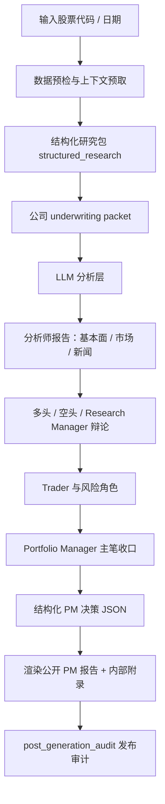

# A 股投研系统完整说明

更新时间：2026-07-11

本文记录当前 TradingAgents A 股投研系统已经具备的真实能力、分析链路、LLM 介入方式、PM 报告生成逻辑和质量控制机制。它不是产品宣传文档，而是一份面向团队维护和迭代的系统说明。

## 1. 系统定位

当前系统的目标不是自动交易，也不是简单生成一篇股票点评。它更接近一个“程序化数据底座 + LLM 分析层 + 多角色投研辩论 + PM 主笔报告”的 A 股投研工作台。

核心任务是：

1. 从可靠数据源获取行情、财务、公告、财报、行业、互动、政策、估值和替代信息。
2. 用程序化逻辑完成数据预检、事实抽取、单位/期间/公式校验和质量审计。
3. 用 LLM 完成程序难以僵硬规则化的研究判断：业务理解、问题生成、竞争分析、定性推理、预期差、反方论证和报告主笔表达。
4. 通过多角色分析、辩论、交易建议、风险审查和组合经理收口，生成面向投资者的 PM 报告。
5. 在报告发布前进行结构化校验和 post-generation audit，防止关键数字、期间、估值、评级和证据链出现不可接受的错误。

当前系统最重要的研究原则是：

> 先看公司靠哪些业务赚钱，再判断哪些业务决定利润池和估值，再围绕这些业务提出关键问题，最后把定性判断和可获得的定量证据连接到预测、估值、风险和证伪条件。

## 2. 总体链路

系统可以概括为以下链路：



其中：

- 程序化层负责事实、计算、校验、边界和可复现性。
- LLM 分析层负责提出好问题、解释因果、判断主矛盾、形成投资语言。
- PM 层负责把所有底稿收口为可读、连续、面向投资者的卖方报告。

## 3. 数据与上下文层

### 3.1 基础数据

系统会优先获取并校验以下基础数据：

| 模块 | 作用 |
| --- | --- |
| `stock_basic` | 公司名称、行业、上市地等基础画像。 |
| `daily` | 最新行情、价格和交易状态。 |
| `daily_basic` | PE、PB、PS、市值、换手率等估值和交易快照。 |
| `income` | 利润表关键项目。 |
| `balancesheet` | 资产负债表关键项目。 |
| `cashflow` | 现金流量表关键项目。 |
| `fina_indicator` | ROE、ROA、毛利率、净利率、成长性和偿债能力等财务指标。 |
| `filing_text` | 可读财报正文、管理层讨论、分部披露和附注。 |

### 3.2 公告与财报链路

当前系统已经加入公告和财报正文读取链路：

- Tushare 公告。
- CNINFO fallback。
- PDF 下载与文本提取。
- 本地 disclosure cache。
- 标题过滤，避免把提示性公告、预约披露、无关公告误当成正式财报正文。
- 业绩预告 / 业绩快报 / 预增 / 预减等官方公告识别。

对于今晚新出的 H1 预增报告这类公告，系统会把它作为 company events 注入 forecast 和 PM 逻辑。若存在官方业绩预告，PM 必须把它作为硬公开证据，重新核对 Q1、Q2、H1、H2 和全年利润/EPS 关系，而不能沿用旧的 run-rate 预测。

### 3.3 通用研究上下文

系统会预取多类通用研究上下文，包括：

| 上下文 | 主要作用 |
| --- | --- |
| `company_business_model_context` | 从财报和公告中总结公司业务模式、产品、客户、收入引擎、成本和现金流机制。 |
| `filing_intelligence_context` | 深读财报正文，提取分部经济性、管理层讨论、会计质量、现金流和附注线索。 |
| `earnings_model_context` | 用最近报告期、年化、季节性和利润/现金流指标形成盈利基准。 |
| `forecast_model_context` | 生成三年预测脚手架、业务线 driver bridge、预期差和 LLM 分析介入图。 |
| `market_expectation_context` | 用市值、估值倍数和盈利基准反推市场隐含预期。 |
| `price_earnings_decomposition_context` | 拆解股价变化来自 EPS、估值倍数还是二者共同作用。 |
| `peer_comparison_context` | 同业估值、成长、盈利、分红、负债和综合评分对比。 |
| `supply_chain_comparison_context` | 判断产业链位置、上下游关系和替代表达。 |
| `industry_kpi_context` | 根据行业生成原生 KPI 清单。 |
| `industry_cycle_context` | 判断行业周期、供需、价格、成本和政策位置。 |
| `commodity_context` | 对资源品、原材料和周期品补充商品价格或价差线索。 |
| `investor_interaction_context` | 读取互动平台，区分正式回应、回避和可验证线索。 |
| `policy_planning_context` | 接入政策和规划文件，判断政策方向、需求斜率和公司受益路径。 |
| `web_fact_check_context` | 对高频但财报覆盖不足的事实做网页交叉核验。 |
| `data_coverage_context` | 审计每个上下文模块的 ready/partial/failed/missing/not_applicable 状态。 |

### 3.4 Gated 行业工具包

系统已接入多类 gated 行业工具包。它们只在公司名称、行业、财报正文、公告或互动证据触发时启用，不会强行套用到无关公司。

当前主要行业工具包包括：

- 白酒。
- 算力租赁。
- 高股息防御。
- 建材。
- 大消费 / 食品饮料。
- 光模块 / AI 数据通信。
- 创新药 / CRO / CDMO。
- 软件 / SaaS。
- 保险。
- 医疗器械。
- 金属矿业。
- 航运 / 运价。
- 生猪养殖。
- 银行 / 金融机构。

这些工具包的作用不是替代财报分部分析，而是当公司业务触发对应行业时，提供行业原生变量。例如：

- 银行看 NIM、存款成本、信贷成本、不良、拨备、CET1、PB/ROE。
- 猪企看猪价、完全成本、出栏量、能繁母猪、OCF、PB/NAV 底部。
- 光模块看 800G/1.6T、AI capex、客户认证、产能良率、ASP、库存、应收和现金流。
- 金属矿业看储量、品位、权益产量、AISC、项目 ramp、金属价格、NAV/SOTP。

## 4. 结构化研究包

系统会生成 `structured_research_context`，它是后续 LLM 和 PM 的机器可读数据源。

其中最核心的是 `underwriting_packet`，它包含：

| 字段 | 作用 |
| --- | --- |
| `company_model` | 公司经营模型，包括业务类型、收入公式、利润公式、现金流公式、资本强度、护城河和结构性风险。 |
| `business_unit_map` | 把财报披露分部和真正驱动经济性的产品、渠道、客户、项目、区域或金融业务拆开。 |
| `segment_models` | 分部收入、收入权重、利润/毛利权重、增速、毛利率、现金转换、景气方向、估值处理和下一验证项。 |
| `underwriting_questions` | 3-6 个真正决定 EPS、FCF、估值和评级的问题。 |
| `forecast_lines` | 三年预测线，包含分部和合并层面的收入、利润、EPS、OCF、capex、FCF 或行业原生指标。 |
| `scenarios` | bull/base/bear 情景、概率、核心经营假设、EPS/FCF/估值和证伪条件。 |
| `thesis_financial_bridges` | 把核心论点映射到收入、利润、EPS、FCF、资本和估值影响。 |
| `moat_evidence_tests` | 对护城河做可观察检验，而不是只记录管理层说法或市场份额标签。 |
| `valuation_buckets` | 互斥的估值桶：core、scenario、optionality、excluded，避免 SOTP 双重计算。 |
| `valuation_closure` | 当前价格、股本、核心价值、概率加权价值、期权价值、预期收益、公式和缺口。 |
| `llm_analysis_layer` | LLM 分析介入层，承载 8 个非僵硬分析节点。 |
| `handoff_manifest` | 下游必须保留的事实、估计、未解决模型格和防丢失合同。 |

## 5. LLM 分析层

当前系统已经把 LLM 的作用从“写报告”前移为“做分析”。最新版本新增了 `LLMAnalysisLayer`，明确要求 LLM 在 8 个环节介入。

### 5.1 业务线问题树

程序可以从财报中抽取收入结构，但很难判断一条业务真正该问什么。LLM 在这里负责：

- 从财报分部出发，识别高收入权重和 thesis-critical 业务。
- 针对每条业务生成公司特定问题。
- 避免套用固定行业模板。

典型问题包括：

- 需求增长来自量、价、份额、渗透率还是周期？
- 客户为什么买，是否有替代品？
- 毛利率由 ASP、成本、利用率、产品结构还是规模效应决定？
- 增长是否消耗现金，是否带来库存、应收、预付或 capex 压力？

### 5.2 利润池排序

系统不再机械地只看收入占比，而是要求结合：

- 收入权重。
- 毛利率和利润权重。
- 增速。
- 现金转化。
- 资本开支强度。
- 竞争侵蚀风险。
- 估值敏感度。

LLM 负责解释哪些业务真正决定投资结论，哪些只是规模业务，哪些可能是第二成长曲线，哪些是风险来源。

### 5.3 竞争和替代分析

程序可以找同行，但很难理解客户为什么换供应商。LLM 负责分析：

- 真正同业和替代表达。
- 客户切换成本。
- 多供应商策略。
- 自研 / 自供 / 替代品风险。
- 新进入者、技术路线、监管变化。
- 价格竞争和利润池迁移。

这一层的原则是：问题必须从公司实际业务出发，而不是从行业标签出发。

### 5.4 定性到定量桥接

很多数据无法直接拿到。系统要求 LLM 在缺数据时不直接变薄，而是：

- 给出有边界的定性判断。
- 明确哪些数据支持这个判断。
- 明确哪些变量不能量化。
- 给出后续需要获取的数据。
- 在可获得数据时升级为定量分析。

例如，公司未披露某业务 ASP 时，报告可以结合收入增速、毛利率变化、行业价格、同行表现判断“可能偏量增驱动”，但不能发明 ASP。

### 5.5 市场预期差

LLM 负责把估值、股价、卖方观点、行业新闻和模型假设综合成预期差判断：

- 当前价格可能隐含什么增长、利润率、ROE 或风险溢价。
- 市场担心什么。
- 市场乐观什么。
- 系统模型和市场分歧在哪个变量、幅度或时间点。
- 下一次财报、公告或行业数据如何验证分歧。

### 5.6 Red Team 反方论证

系统要求 LLM 扮演怀疑者：

- 正面 thesis 最可能错在哪里。
- 空头会如何反驳。
- 哪个指标先恶化。
- 什么数据出现后必须下修。
- 若系统偏谨慎，最强上行反证是什么。

最终 PM 报告必须吸收这些反方观点，但不能把它们机械列成“空头观点清单”。

### 5.7 估值解释

估值计算由程序控制，LLM 不负责随意计算目标价或安全价。LLM 负责解释：

- 为什么采用某种估值方法。
- 哪个业务变量决定估值倍数上修或下修。
- 哪些风险导致折价。
- 哪些经营假设改变 EPS、FCF、ROE、PB、PE 或 SOTP。
- 当前价格贵在哪里、便宜在哪里。

### 5.8 最终主笔综合

最后，LLM 要作为卖方主笔编辑，把分析层内容写成投资者能读懂的报告：

- 删除底稿痕迹。
- 合并重复观点。
- 把问题清单改写成投资论证。
- 把模块输出改写成“结论 -> 证据 -> 机制 -> 反方 -> 财务/估值影响 -> 验证条件”。
- 保持一条连续主线，而不是堆砌多个研究模块。

## 6. 预测与估值链条

系统当前的预测链路强调：

1. 从财报收入结构出发。
2. 按利润池和 thesis-critical 程度选择重点业务。
3. 为每条业务生成 driver bridge。
4. 尽量形成三年预测。
5. 将分部收入/利润合并到集团收入、利润、EPS、OCF、capex 和 FCF。
6. 将 bull/base/bear 情景映射到估值。
7. 由程序做股本、EPS、每股价值、概率加权价值和安全价一致性校验。

当存在结构化财报分部时，forecast driver 会优先从财报分部生成；没有结构化分部时，才退回行业 driver。

系统当前明确禁止：

- 没有每个重要业务的三年数值就声称 bottom-up 模型。
- 在缺少 shipment、ASP、利用率、毛利率等关键数据时发明精确数值。
- 把市场传言、Knowledge Planet、行业报告或单一券商观点当成硬事实。
- 手工重复计算程序已经控制的目标价、安全价或概率加权价值。

## 7. 多角色辩论层

### 7.1 分析师层

系统包含基本面、市场、新闻等分析师角色。它们读取相同的上下文，但关注点不同：

- 基本面分析师强化财报、分部、盈利、现金流、会计质量。
- 市场分析师关注股价、估值、技术确认、相对强弱和市场隐含预期。
- 新闻分析师关注公告、事件、政策、外部事实和短期催化。

### 7.2 Bull / Bear 研究员

多头和空头不再只是写正反观点，而是要围绕 shared underwriting packet 中的问题和模型格进行攻击或修正：

- 多头提出哪些证据可以上调假设、概率或估值。
- 空头指出哪些证据不足、假设过度、现金流恶化或估值过满。
- 如果证据不能支持数字变化，必须标为 watch / unchanged，而不是强行改变模型。

### 7.3 Research Manager

Research Manager 是模型裁判，负责：

- 汇总基本面、市场、新闻、多头、空头观点。
- 对每个 underwriting question 给出证据加权结论。
- 决定接受哪些模型变更。
- 保留哪些问题为 unresolved。
- 输出 `Accepted Underwriting Model` 和 `Model Change Ledger`。

Research Manager 不应为了得到某个评级而调模型；它的职责是让模型前后一致。

## 8. PM 报告生成

### 8.1 PM 的角色

Portfolio Manager 不是第一位分析公司的人，而是最终主笔和资产配置判断者。它必须：

- 读取 Research Manager 的 accepted model。
- 保留 canonical model snapshot。
- 不得静默修改股本、EPS、期间、估值和核心假设。
- 将 LLM 分析层、辩论结论、风险审查和交易建议收口成一篇可读报告。

### 8.2 当前 PM 报告的公开结构

公开 PM 报告由 renderer 控制为 8 个主要章节：

1. 投资结论与核心矛盾。
2. 公司拆解与分部经济性。
3. 行业周期、竞争格局与护城河。
4. 经营质量、会计质量与资本配置。
5. 核心投资逻辑与财务传导。
6. 自主预测模型与敏感性。
7. 市场预期差、估值与安全边际。
8. 风险、催化剂、验证日历与操作建议。

PM 正文必须是卖方研究报告，而不是底稿。它不能公开展示：

- 原始 research questions。
- LLM intervention map。
- KPE/KSI 处置 ledger。
- 证据等级流水。
- handoff/model-change 审计。
- 过长机制矩阵。

这些内容会进入内部附录。

### 8.3 内部附录

系统将公开报告和内部底稿拆开：

- `5_portfolio/decision.md`：面向投资者的公开 PM 报告。
- `5_portfolio/internal_appendix.md`：内部附录，保存矩阵、ledger、审计和底稿。
- `5_portfolio/decision_full.md`：完整版本。
- `5_portfolio/canonical_decision.json`：结构化 PM 决策。

这样可以保证外部报告不像研究底稿，同时内部仍可审计。

## 9. 报告深度链条

当前系统最新强化的核心研究链条是：

```text
财报收入结构
-> 利润池排序
-> 分业务问题树
-> 定性/定量回答
-> 市场预期差
-> 估值传导
-> 证伪指标
```

### 9.1 财报收入结构

从财报分部出发，优先识别收入占比高或 thesis-critical 的业务。系统不再预设“某行业一定要分析某几条业务线”，而是以公司披露为起点。

### 9.2 利润池排序

收入占比只是起点。系统还要求判断：

- 哪个业务贡献利润。
- 哪个业务决定增量。
- 哪个业务决定估值弹性。
- 哪个业务是风险源。
- 哪个小业务可能是第二成长曲线。

### 9.3 分业务问题树

每个重要业务至少要回答：

- 需求问题。
- 竞争问题。
- 盈利问题。
- 现金流问题。
- 估值影响问题。
- 证伪问题。

### 9.4 定性/定量回答

基础要求是做定性讨论。若能够获取数据，则升级为定量讨论。缺数据不能省略，而要说明：

- 现有披露没有什么。
- 因此只能做什么层级的判断。
- 该缺口如何影响置信度。
- 后续验证什么数据。

### 9.5 预期差和估值传导

每个核心 thesis 必须说明：

- 市场可能在 price in 什么。
- 我们和市场分歧在哪个变量。
- 这个变量如何影响收入、利润、EPS、FCF 或倍数。
- 哪个数据会证明或推翻分歧。

## 10. 质量控制

### 10.1 Data Coverage Audit

`data_coverage` 会把每个模块标为：

- `ready`。
- `partial`。
- `failed`。
- `missing`。
- `not_applicable`。

PM 不允许把 failed 或 missing 模块当成中性事实。如果缺口触及核心 thesis，必须降低置信度、扩大情景区间、加入检索任务，必要时阻断发布。

### 10.2 Post-generation Audit

PM 生成后，系统会写入：

- `5_portfolio/post_generation_audit.md`。
- `5_portfolio/publication_status.md`。
- `5_portfolio/generation_status.json`。

审计内容包括：

- 是否出现自由文本 fallback。
- 是否结构化 JSON 可读。
- 是否存在股本、EPS、利润、期间、单位冲突。
- H1/Q2/Q3 等期间语义是否混淆。
- 估值公式和程序计算是否一致。
- KPE/KSI 是否被正确引用和处理。
- 分部深度、同业、预期差、证伪条件是否足够。
- PM 是否静默修改 Research Manager 的 canonical model。

### 10.3 阻断与 review 的区别

正式阻断通常用于：

- ticker、期间、单位、股本、EPS、估值或 handoff 出现决策级冲突。
- Research Manager 或 PM 结构化生成不可读。
- 官方业绩预告等硬证据被错误忽略。
- 报告评级、目标价、仓位建议存在不可发布风险。

Review 项通常用于：

- 分部深度不足。
- 同业比较不够精确。
- 部分行业数据缺失。
- KPE/KSI 需要后续验证。
- 证据等级或格式需要改善。

Review 项不会自动改变评级，但会影响置信度、仓位和后续检索任务。

## 11. 当前产物目录

一次完整报告通常会生成：

```text
reports/{ticker}_{name}_{timestamp}/
  0_context/
    structured_research.json
    company_underwriting.json
    data_coverage.md
    filing_intelligence.md
    company_business_model.md
    forecast_model.md
    market_expectation.md
    peer_comparison.md
    industry_kpi.md
    industry_cycle.md
    ...
  1_analysts/
    fundamentals.md
    market.md
    news.md
  2_research/
    bull.md
    bear.md
    manager.md
  3_trading/
    trader.md
  4_risk/
    aggressive.md
    conservative.md
    neutral.md
  5_portfolio/
    decision.md
    internal_appendix.md
    decision_full.md
    canonical_decision.json
    generation_status.json
    publication_status.md
    post_generation_audit.md
  complete_report.md
```

其中最重要的文件是：

- `0_context/company_underwriting.json`：公司级结构化 underwriting 模型。
- `0_context/forecast_model.md`：预测、业务线、预期差、LLM 分析介入图。
- `5_portfolio/canonical_decision.json`：PM 结构化决策。
- `5_portfolio/decision.md`：公开 PM 报告。
- `5_portfolio/internal_appendix.md`：内部底稿。
- `5_portfolio/post_generation_audit.md`：发布审计。

## 12. 当前系统边界

当前系统已经具备较强的投研自动化能力，但仍有边界：

1. 行业覆盖不可能一次性完整。未触发 gated 工具包的公司仍依赖财报、同行和 LLM 推理。
2. 同业标签仍可能过宽，真实可比公司需要 LLM 和人工继续修正。
3. 高频经营数据并不总能拿到，例如 ASP、订单、排产、渠道库存、客户认证、海外采购节奏。
4. LLM 可以解释因果，但不能发明数字。
5. 程序可以校验数字，但不能替代分析师判断主矛盾。
6. 官方公告、业绩预告和最新事件依赖公告链路和网络可用性，仍需要审计兜底。
7. PM 报告深度受数据完整性、行业工具包触发、LLM 输出质量和 post-generation audit 共同影响。

## 13. 后续建议

为了进一步提升报告质量，建议后续继续推进：

1. 为 `llm_analysis_layer` 增加更严格的质量审计，检查 8 个节点是否为空、是否泛化、是否真正链接到业务线。
2. 增加行业级问题树模板库，但只作为 LLM 参考，不作为硬编码清单。
3. 增加真实 peer universe 选择逻辑，区分交易所行业、产业链同业和投资替代表达。
4. 强化预期差量化，反推当前市值隐含的利润、增速、ROE、毛利率或周期位置。
5. 对 PM 正文做可读性审计，检查是否有底稿痕迹、重复段落、模块堆砌或过度表格化。
6. 将优秀报告和被审计阻断报告转化为 regression tests。
7. 建立“报告失败 -> 通用规则 -> 测试覆盖”的闭环，避免只做单票 patch。

## 14. 一句话总结

当前投研系统的方向已经从“多模块材料拼接”升级为“财报分部驱动、LLM 深度分析、模型一致性约束、PM 主笔收口”的研究工作流。理想输出不是一份底稿，而是一篇能够说明公司如何赚钱、市场错在哪里、估值如何传导、什么会证伪判断的高质量卖方 PM 报告。
