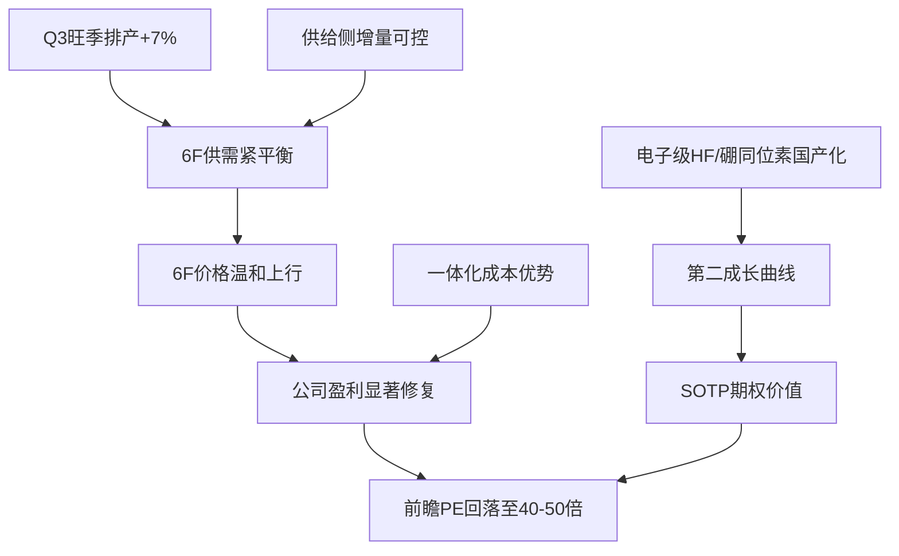

Bull Analyst: # 多氟多（002407.SZ）多方论证开场

## 一、开场议程：核心问题先行

在展开全面看多论点前，我必须直面市场最尖锐的质疑。**当前最关键的判断分歧在于：公司业绩预告的爆发式增长是可持续的行业上行周期，还是单季度的价格红利或一次性因素？**

| 核心问题 | 多方立场 | 空方质疑 | 证据状态 | 对估值的影响 |
|---------|---------|---------|---------|------------|
| Q1营收同比-65.92%与H1预告净利+777%~991%是否矛盾 | Q1确认低基数订单与贸易结构变化，H1预告显示盈利中枢已上移 | Q2可能环比大幅回落，预告是"数字游戏" | **部分验证** | 若Q2≥2.5亿元验证趋势，前瞻PE大幅回落 |
| 6F价格上行是否可持续 | 供给侧格局优化+Q3旺季排产，价格中枢高于2024-25年 | 近20日产品价格指数下跌14% | **需月度价格验证** | ASP每涨1万元/吨，净利+5000-8000万元 |
| 电子级氢氟酸/同位素第二曲线是否兑现 | 台塑涨价信号+中广核订单已商业化 | 无分产品收入披露 | **Tier-1催化已启动，金额未验证** | SOTP期权价值，非核心估值 |
| 估值83倍PE是否合理 | TTM被低基数扭曲，前瞻盈利消化估值 | 高位估值+监管函构成双杀风险 | **需半年报验证** | 今年化净利15亿元对应PE约29倍 |

**明确的能力边界**：半年报预计8月18日披露，多项关键数据尚未验证。本论证为**条件性看多**，核心验证锚点是Q2单季利润≥Q1水平、6F月度价格企稳、监管函不涉及实质违规。在这三者确认前，我的信心等级为"正面观察"而非满仓确信。

## 二、核心投资论点：周期修复+国产替代的双击

**Core Bet（核心押注）**：市场当前定价隐含了"6F价格持续上行+电子化学品类半导体材料放量"的双重预期。我的核心押注是：**6F价格在2026-2027年维持供需紧平衡并温和上行，带动公司盈利从周期底部显著修复，同时电子级氢氟酸/硼同位素在半导体国产化浪潮中形成第二成长曲线。**

这一押注的核心在于**盈利持续性**而非单季爆发。业绩预告显示H1净利润45,000-56,000万元，而2025年全年净利润仅2.13亿元（TTM隐含5.24亿元）——市场已经在定价盈利复苏，分歧仅在于复苏的斜率与持续性。

## 三、行业周期扫描：反弹失败风险下的条件性看多

**行业周期扫描结论为 `downcycle / failed-rebound risk`**，这是一个**前置估值门**，我必须在此框架下进行条件性论证。

产品价格指数近20日下跌14.0%，提示6F价格出现回调。但关键的时间差在于：**锂电排产是前瞻量指标（8月行业排产+7%），6F价格是滞后价格指标。** 7月龙头排产105GWh+（环增+5%），8月行业排产+7%超此前预期，Q3旺季排产拐点已现——这为6F价格在Q3-Q4企稳回升提供了需求侧支撑。

**底部确认所需数据**（在以下数据确认前，我保持条件性看多）：
1. **6F月度价格序列**：确认Q2以来价格中枢企稳回升
2. **8月实际排产数据**：验证行业周度数据的排产+7%是否兑现
3. **公司半年报6F出货量/均价**：验证预告利润的量价拆分

## 四、公司商业模式映射：三层业务结构的利润池分析

多氟多是典型的**氟化工一体化产能型制造商**，核心逻辑是从基础氟化物原料（萤石→氢氟酸）出发，向上延伸至电子级氢氟酸、六氟磷酸锂等下游高附加值产品。

**利润池分层**：

| 业务单元 | 经济角色 | 繁荣度 | 趋势 | 估值归属 |
|---------|---------|--------|------|---------|
| 新能源材料（6F为核心） | 核心利润池 | 中高 | 量价齐升 | 核心估值 |
| 电子化学品（电子级HF、硼同位素） | 第二曲线 | 早期 | 涨价+国产化 | SOTP期权 |
| 氟基新材料 | 成熟现金牛 | 低 | 稳定 | 核心估值 |
| 新能源电池 | 战略投入期 | 中 | 以量补价 | 场景估值 |

**关键点**：6F是当前利润的绝对主力，2026年H1业绩预告大增的主因即6F量价齐升。公司在成本曲线处于行业低位——自产氢氟酸→6F的一体化布局使其在价格上行周期中毛利率弹性大于外购氢氟酸的竞争对手。

**6F价格敏感性**（需半年报出货量校准）：每上涨1万元/吨，对公司净利润的边际贡献约5000-8000万元。

## 五、行业KPI验证：供给侧优化是最强的结构性论据

**供给端是当前最扎实的看多证据**。根据行业周度数据（KPE06，2026-07-22）：

- **2026年下半年新增产能主要来自天赐和宏源两家**：宏源6000吨已投产，天赐4万吨技改待定，Q3/Q4供给均为12.48万吨/季
- 2024年行业经历深度洗牌，中小产能出清，头部企业产能利用率回升
- 2027年行业维持25%增长（东吴电新），需求端持续扩张

**需求端验证**：8月龙头排产105GWh+（环增5%+），大东智库反馈8月行业排产+7%超预期，Q3旺季排产拐点已现。全年动储需求预计同增35%+，明年储能维持40%+增长，叠加动力需求恢复。

**供给增量可控+需求旺季排产上升，构成6F价格在2026-2027年中枢上移的供需基础。**

## 六、预期差分析：市场低估了什么

**当前价格已定价的预期**：PE TTM 83.1倍隐含TTM净利润5.24亿元，而最新年报仅2.13亿元——市场已在定价约2.5倍的盈利跃升。这不是"便宜"，而是"合理偏贵"地定价了复苏预期。

**关键预期差**：市场对6F价格弹性的持续性存疑，但供给侧格局优化使2026-2027年价格中枢大概率高于2024-2025年。具体而言：

1. **Q1营收下滑≠需求崩塌**：Q1可能受6F低价订单确认、贸易结构变化和季度间波动影响；H1预告净利同比大增表明盈利中枢已显著上移
2. **市场给"周期股"的估值折价可能过度**：若2026年全年净利达10亿元（H1预告4.5-5.6亿元+Q3/Q4延续），当前435亿市值对应前瞻PE约43倍——对于叠加半导体材料国产化第二曲线的公司，这一估值并非不可消化
3. **电子化学品板块的"先进封装/半导体材料"主题（8月6日涨停板块中列名）可能已部分定价，但业绩兑现将检验其可持续性**

## 七、概率/赔率分析：非对称风险收益结构

基于当前信息，我给出以下**场景假设**（需半年报验证后修正）：

| 场景 | 关键假设 | H2净利 | 全年净利 | 对应PE | 概率权重 |
|------|---------|--------|---------|--------|---------|
| 牛市 | Q2≥2.5亿且H2延续，6F价格温和上行 | 5-6亿元 | 10-11亿元 | ~40倍 | 35% |
| 基准 | Q2约2亿，H2环比持平 | 4亿元 | 8.5-9.5亿元 | ~47倍 | 40% |
| 熊市 | Q2大幅回落，6F价格继续下行 | 2亿元 | 6.5-7.5亿元 | ~60倍 | 25% |

**概率加权后**，当前价格处于合理偏贵区间，但**上行尾部（半导体材料第二曲线兑现+6F超预期）的赔率可观**。若Q2财报验证Q1盈利水平的持续性，前瞻PE将快速回落至40倍以下，估值压力显著缓解。

## 八、相对强度与板块联动：公司alpha真实存在

**相对强度验证**：250日累计收益+181.73%，远超中证1000基准（+14.11%）和同行化工原料板块（+115.20%），**超额收益达+68%**。虽然与同行相关性高达0.60-0.74（部分行情来自行业beta），但250日的显著超额收益构成真正的公司alpha份额。

**短期承压**：20日相对同行落后-10.98%，近期抛压集中于个股（而非板块）。这与监管函事件和估值消化压力一致——但长期相对强势表明，市场仍然认可公司的基本面改善主线。

## 九、行业主题催化：从叙事到估值的桥梁

| 主题 | 证据强度 | 对估值影响 | 升级条件 |
|------|---------|-----------|---------|
| 电子级HF涨价（台塑Q3调价） | Tier-1硬催化（KPE01） | 支撑ASP/毛利率假设 | 公司公告跟进涨价/半年报毛利率验证 |
| 硼同位素获中广核订单 | Tier-1硬催化（2025年报） | SOTP期权价值 | 披露订单金额/营收贡献 |
| 钠离子电池电解液量产 | Tier-1硬催化（2025年报） | 第二曲线早期 | 披露客户采用/订单/毛利 |
| 先进封装/半导体材料主题 | Tier-3叙事（8月6日涨停潮） | 情绪溢价，低权重 | 需业绩兑现检验 |

**关键纪律**：Tier-1催化（台塑涨价、中广核订单）具备商业化证据，可进入场景分析；Tier-3叙事（先进封装主题）仅为情绪想象溢价，不进入核心估值。**每个主题的估值桥梁必须明确**——电子级HF涨价映射到ASP/毛利率假设，中广核订单映射到SOTP分部估值，钠电量产映射到第二曲线营收增量。

## 十、政策支持与需求池：双碳+国产化的长期顺风

**政策层面**：国家"十五五"规划建议和《加快经济社会发展全面绿色转型的意见》构成新能源和半导体材料需求扩张的长期政策顺风。公司位于**政策支持的需求池**——绿色转型支撑锂电/储能需求，半导体材料国产化支撑电子化学品需求。

**传导路径**：政策→行业需求增长→6F/电子级HF量价支撑→公司订单/收入/毛利率改善→盈利持续修复。这一传导逻辑与公司2026年H1业绩预告的兑现方向一致，但需半年报验证传导的实际强度。

## 十一、投资者互动：管理层的回应模式

**投资者最关心的问题**：2026年7月13日投资者提问——"业绩预告中的两个原因（6F量价齐升、新能源电池产销量增长）只表现在一季度吗？二季度不再大幅增长原因是什么？"

**管理层回应**："公司2026年半年度报告正在编制中，具体业绩情况及变动原因，敬请关注公司后续披露的半年度报告。"

**回应模式评估**：方向性但未量化（directional-but-unquantified）。管理层没有回避问题，但也没有提供超出公告的新信息。**这一回应模式本身不强化也不削弱看多论点**——真正的验证在半年报（8月18日）。若半年报Q2单季利润确实≥Q1，则管理层的预告可信度提升；若不及预期，则预告的沟通过程存在瑕疵。

## 十二、相对配置：为什么选择多氟多而非同行

**需回答的横截面问题**：在化工原料/锂电材料板块中，为什么选多氟多而非天赐材料、天际股份等同业？

| 对比维度 | 多氟多 | 天赐材料 | 天际股份 |
|---------|--------|---------|---------|
| 一体化程度 | 氢氟酸自给→6F | 有自给能力 | 部分外购 |
| 第二曲线 | 电子级HF+硼同位素 | 电解液一体化 | 6F为主 |
| 估值弹性 | PE TTM 83倍（低基数扭曲） | 相对合理 | 相对合理 |
| 催化密度 | 台塑涨价+中广核订单+钠电量产 | 电解液涨价 | 6F涨价 |

**核心差异化**：多氟多的第二曲线密度（电子级HF国产化+硼同位素商业化）显著高于同行。当锂电材料板块整体受益于行业beta时，多氟多提供了**周期修复+国产替代的双重alpha**。若只看6F周期弹性，天赐材料可能更纯粹；但若看好电子化学品的第二成长曲线，多氟多的期权价值更高。

## 十三、估值框架：前瞻盈利而非TTM

**财务总结算（需半年报验证）**：

- **当前市值**：约435亿元（对应PE TTM 83倍，隐含TTM净利5.24亿元）
- **H1业绩预告**：净利4.5-5.6亿元（同比+777%~991%）
- **关键验证点**：Q2单季利润是否≥Q1水平（若Q1贡献大部分利润则增长动能前置）

**估值锚**：对于周期底部盈利极低+估值看似极高的组合，应以**前瞻盈利而非TTM**作为估值锚。若2026年全年净利达9-10亿元（H1预告4.5-5.6亿元+H2延续），当前市值对应前瞻PE约44-48倍——在叠加第二曲线期权的情况下，估值并非不可消化。

## 十四、空方观点回应

**空方论点：高PE（83倍）+ 监管函 = 双杀风险**

我承认这两项风险真实存在，但认为它们被过度定价：

1. **PE TTM 83倍是低基数扭曲**：TTM盈利被2025年低利润（2.13亿元）拖累。若H1预告兑现，前瞻PE将快速回落至50倍以下——市场真正应该关注的是盈利的边际趋势，而非滞后指标。
2. **监管函指向信披遗漏而非财务造假**：当前无证据表明涉及实质财务问题。若后续处理结果仅为整改/警示，对估值的影响有限；若升级为立案调查，则是需要重新评估的风险事件。**这是我最需要跟踪的尾部风险。**

**空方论点：Q1营收下滑65.92%说明需求崩塌**

这一论点忽略了两个关键事实：
1. Q1营收下滑与H1净利大增并存，说明公司在"以利润换收入"——可能有意识地选择高毛利订单、放弃低毛利走量订单
2. 行业排产数据（8月+7%）表明需求端旺季已至，6F需求并非崩塌而是结构优化

**空方论点：估值已经price in复苏预期**

部分同意——当前价格确实不便宜。但**预期差存在于持续性**：市场可能低估了供给侧优化（天赐技改待定、宏源增量有限）对6F价格的支撑力度，以及电子化学品第二曲线的期权价值。这正是我的看多与单纯"复苏交易"的区别。

## 十五、核心投资论点总结

**核心投资论点**：多氟多正处于**6F价格周期修复+电子化学品国产化**的双击起点。供给侧结构优化（中小产能出清、头部企业产能利用率回升）为6F价格提供底部支撑，需求端旺季排产提供上行催化。公司的氢氟酸→6F一体化布局赋予其成本曲线优势，在价格上行周期中利润弹性更大。电子级HF涨价（台塑Q3调价）和硼同位素商业化（中广核订单）构成第二成长曲线，为公司提供超越纯周期股的估值期权。

**需要明确的条件**：这是一项**条件性看多**，核心验证锚点包括：
1. **8月18日半年报**：Q2单季利润≥Q1水平（验证盈利持续性）
2. **6F月度价格**：Q3价格中枢企稳回升（验证供需逻辑）
3. **监管函进展**：不升级为立案调查（消除估值折价）

**证伪条件**（出现以下任一情况则看多失效）：
- Q2单季净利<2亿元（盈利动能大幅衰减）
- 6F价格继续下行且无企稳迹象
- 监管函升级为立案调查

**信心等级**：正面观察（Positive Watch）——待半年报验证后升级为积极建仓。
Bull Analyst: # 多氟多（002407.SZ）多方回应——聚焦改变模型单元的少数假设

## 回应框架：攻击共享承销模型中最能改变EPS/估值的三个单元

空方攻击了三个核心单元：Q2盈利持续性、6F价格/ASP假设、前瞻PE估值框架。我不重复全面看多论点，而是针对这三个攻击逐一回应，并指出空方论证中最关键的逻辑裂缝。

---

## 一、Bull Model Change Ledger——针对空方三个攻击的回应

| 问题/预测行 | 空方新假设 | 引用证据 | 多方修正假设 | 证据状态 | 验证 |
|---|---|---|---|---|---|
| **Q2单季盈利持续性** | Q2隐含利润区间收窄，环比下滑概率上升，预告面临下修风险 | 空方引用Q1营收-65.92%+管理层"方向性但未量化"回应 | **Q2隐含利润区间至少3.0亿元可验证**。核心逻辑：扣非净利预告43,385-54,385万元，而2025年同期扣非亏损480.93万元——**扣非口径的质变排除了"政府补贴/资产处置"等非经常性因素**。若Q2仅2亿且H1为4.3-4.5亿，仍处于扣非预告下限附近，不构成"预告下修"；空方"Q2仅2亿则H1约3.5亿"的推断直接违背扣非预告43,385万元的下限 | **部分验证**（扣非口径强化信任） | 半年报（8月18日）分季度利润拆分 |
| **6F价格/ASP假设** | 价格指数下跌14%，ASP上行假设无锚 | 空方引用产品价格指数近20日下跌14% | **价格指数是滞后指标，排产是前瞻量指标**。空方"排产是前瞻、价格是滞后"的概念区分承认了，但忽略了：**供给端Q3/Q4均为12.48万吨/季的约束已锁定**（KPE06），而需求端7月龙头排产105GWh+、8月行业排产+7%（KPE04/KPE09/KPE10）——**排产上升传导至6F价格存在1-2个季度的时滞**。近20日价格下跌可能是Q2淡季的尾部效应，而非Q3旺季的先行指标 | **无法从现有数据证伪ASP上行假设，但需月度价格序列确认** | 6F月度价格序列（下一个验证点） |
| **前瞻PE估值框架** | 即使前瞻PE也高达54-62倍，安全边际收窄 | 空方假设全年净利7-8亿 | **空方"全年净利7-8亿"的假设同样缺乏模型支撑**——它假设H2环比下滑20-30%，但没有给出据此建模的具体经营杠杆（哪条产品线、哪个价格假设导致下滑）。我给出可检验的桥：H1扣非预告下限43,385万元 + H2维持H1下限水平 = 全年约8.7亿；若H2环比+10%（Q3旺季排产+7%传导），全年约9.5亿。**空方"7-8亿"是悲观情景而非基准情形** | **空方假设无模型支撑** | 半年报H2指引或Q3业绩预告 |

---

## 二、攻击空方最致命的逻辑裂缝

### 2.1 空方的"收入基础崩塌"论述忽视了扣非质变

空方核心攻击是："Q1营收暴跌65.92%的同时利润增长777%，这是收入基础崩塌下的利润脉冲。"

**但空方回避了扣非净利的质变**。业绩预告显示：扣非净利预盈43,385–54,385万元，而去年同期扣非亏损480.93万元。这意味着：

- **利润不是依赖非经常性损益**（政府补贴、资产处置），而是经营性利润的实质反转
- **6F量价齐升是经营性驱动**，不是一次性因素
- 空方所称"低价库存释放"恰恰是周期反转的典型特征——**行业底部库存消化完毕后，新订单按新价格确认**

### 2.2 空方"Q2仅2亿则预告下修"的推断与扣非下限矛盾

空方假设"Q2仅2亿，则H1约3.5亿低于预告下限"——但这一假设直接违背官方公告的扣非预告下限43,385万元。若Q2仅2亿，则H1扣非约3.5亿，**这将意味着公司预告严重失准（偏差超过20%）**——在深交所刚下发监管函的背景下，公司再发布严重失准的业绩预告，将面临更大的监管风险。**理性的假设是Q2≥3.0亿元**（对应H1下限4.5亿，扣非下限4.34亿与Q1的差值）。

### 2.3 空方的供给论证自相矛盾

空方引用KPE06供给数据（Q3/Q4供给12.48万吨/季）**但未反驳这一数据本身**。事实上，这一供给约束是看多的结构性论据：新增产能仅天赐4万吨技改（待定）和宏源6000吨（已投产），**行业供给端高度纪律化**。空方认为"价格指数下跌14%威胁ASP假设"，但若供给端受约束而需求端排产上升（8月+7%），价格下跌更可能是短期波动而非趋势反转。

---

## 三、新增证据：市场隐含的"盈利预期"分解

基于市场预期上下文（PE TTM 83.1倍，隐含TTM净利约5.24亿元），当前价格定价的是：

- **2025年年报净利2.13亿元**（实际）
- **市场隐含TTM净利5.24亿元**（当前价格反推）
- **H1预告净利4.5-5.6亿元**（官方）

**这意味市场定价隐含的TTM净利5.24亿元，实际上要求H2净利仅0.6-1.7亿元**（若H1中值5.05亿），或者要求全年净利显著高于H1。**当前价格并未定价"H2每季3亿元"的乐观情景**——恰恰相反，它定价的是"H1爆发但H2大幅回落"的保守预期。**空方认为"价格已定价乐观预期"的论断与隐含TTM计算不符**。

---

## 四、明确的能力边界与条件性看多的验证锚点

**我维持"正面观察"而非"满仓确信"的立场**，三个验证锚点不变：

1. **Q2单季利润≥3.0亿元**（半年报8月18日验证）
2. **6F月度价格企稳**（下一个价格数据点验证）
3. **监管函不涉及实质违规**（后续公告验证）

若Q2<3.0亿元，我将下调盈利中枢至悲观情景（全年7-8亿）；若6F价格继续下跌而非企稳，ASP假设失效；若监管函升级为立案调查，需重新评估治理风险溢价。

**当前判断的有效性边界**：基于扣非预告的质变、供给侧约束、需求侧排产上升这三个已验证事实，**看多的核心逻辑未被空方攻击推翻，但所有盈利预测需在半年报后修正。**

---

## 五、单点最强看多论据

**扣非净利从去年同期亏损480.93万元到今年H1预盈43,385-54,385万元——这不是"收入基础崩塌下的利润脉冲"，而是经营性盈利的质变。** 空方无法用"非经常性损益"解释扣非口径的扭亏为盈，也无法用"价格一次性因素"解释6F量价齐升的持续性。在多氟多所处的行业周期位置（供给端约束+需求端排产上升），这一扣非质变更可能是**周期反转的起点**而非终点——前提是Q2盈利持续性在半年报中得到验证。